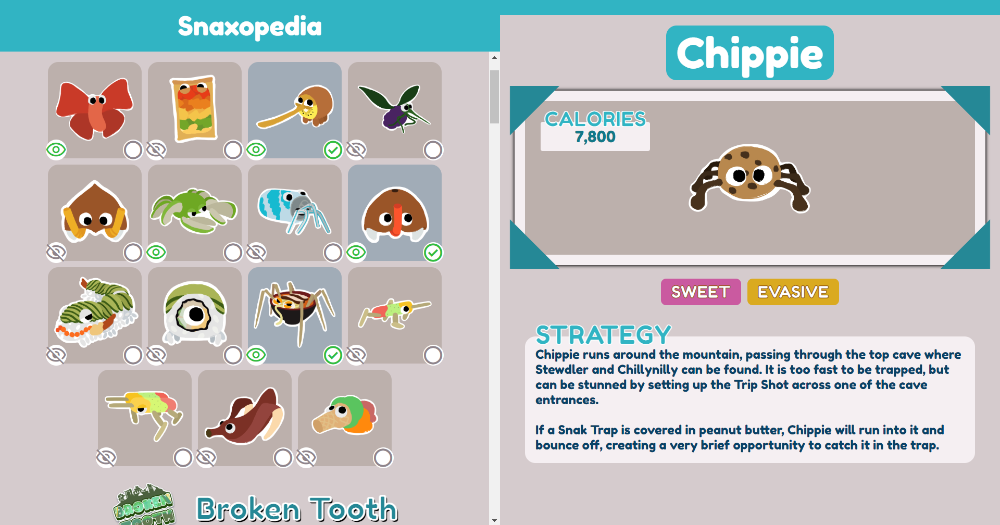

# Snaxopedia
A page to keep track of your bugsnacks. Uses the wikifandom API to import the latest strategies for catching your bugsnacks.




# How to run

## ui
```
cd snaxopedia-ui
pnpm i

cd..
pnpm run dev::ui
```
## api
You need to have deno and optionally denon to start the server.
```
pnpm run dev::api
```